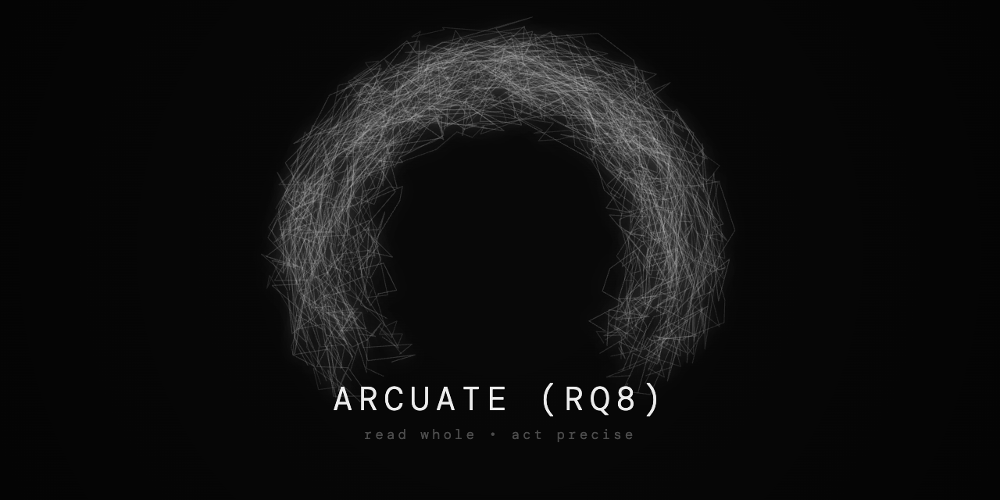

# Arcuate

<p align="center">
  
</p>

> *Extracts signatures and docstrings from a codebase so an agent can read the whole project in context — and open source files only where it needs to act.*

A CLI tool that scans a codebase and generates a compact Markdown mirror of it, optimised for LLM consumption. Each source file becomes a `.md` file containing only its public interface — signatures, docstrings, and a link to the original. A global `INDEX.md` maps the full project tree with dual links to docs and source.

The source stays untouched. The mirror is small enough to load whole.

---

## What it does

- **Walks the codebase** recursively, preserving directory structure
- **Parses source files via AST** — no LLM, no network, no runtime required
- **Extracts the public interface**: function and class signatures, docstrings, type annotations
- **Filters private functions and methods** — any function or method prefixed with `_` is excluded; classes are always included
- **Generates a `.md` mirror**: one file per source file, signatures only, link to original
- **Produces `INDEX.md`**: full project tree with dual links — `.md` docs and source file for every node

The result is a representation an agent can read whole. When it needs to act on a specific part, it opens the source.

---

## Architecture

```
┌─────────────────────────────────────────────┐
│  Delivery Layer                             │
│  main.rs — CLI args, exit codes             │
│  delivery/factories.rs — wires adapters     │
│    into use cases                           │
└────────────────┬────────────────────────────┘
                 │ uses
┌────────────────▼────────────────────────────┐
│  Application Layer  (Use Cases)             │
│  FileScanner — walks filesystem, dispatches │
│  analyzers, builds ProjectLayout            │
└────────────────┬────────────────────────────┘
                 │ uses
┌────────────────▼────────────────────────────┐
│  Infrastructure Layer  (Adapters)           │
│    ├── PythonParser  (rustpython-parser)    │
│    │   implements SourceCodeAnalyzer        │
│    └── MarkdownWriter                       │
│        implements OutputWriter,             │
│                  IndexWriter                │
└────────────────┬────────────────────────────┘
                 │ produces
┌────────────────▼────────────────────────────┐
│  Core Domain   (Entities + Ports + Policies)│
│  entities/  DocumentedConstruct,            │
│             ParsedSourceFile, ProjectLayout │
│             SourceFileAnalysis              │
│  ports/     SourceCodeAnalyzer, ParserError │
│             OutputWriter, OutputWriterError │
│             IndexWriter                     │
│  policies/  ExclusionRules                  │
└─────────────────────────────────────────────┘
```

**Dependency rule:** arrows point inward only. The domain knows nothing of infrastructure or delivery.

---

## How it works

**Phase 1 — Scan**
`FileScanner` walks the input directory with `walkdir`, collecting all source files. Each file is dispatched to the language-specific parser registered for its extension.

**Phase 2 — Analyze**
Each parser reads the file and runs an AST traversal — no execution, no import resolution, no network. It extracts every public construct: class signatures, method signatures, module-level functions, type annotations, and the first docstring of each. Private constructs (prefixed with `_`) are filtered out.

**Phase 3 — Write**
`MarkdownWriter` generates two outputs:
- A `.md` file for each source file, placed in the mirror directory at the same relative path
- `INDEX.md` at the root of the output, with the full project tree and dual links to docs and source

---

## Output format

Given a project at `~/projects/myapp`, running:

```bash
arcuate --input-dir ~/projects/myapp
```

Produces `~/projects/myapp/myapp_rq8_docs/`:

```
myapp_rq8_docs/
├── INDEX.md
└── src/
    ├── calculator.md
    └── utils.md
```

A generated `.md` file (`src/calculator.md`):

````markdown
# calculator.py — Financial calculation utilities

## `class Calculator:`

> Class docstring here.

### `def add(a: float, b: float) -> float:`

> Returns the sum of two values.

### `def multiply(a: float, b: float) -> float:`

> Returns the product of two values.

## `def format_currency(amount: float, symbol: str = "$") -> str:`

> Formats a float as a currency string with the given symbol.
````

`INDEX.md`:

````markdown
# Index

- **src/** — Financial calculation utilities
  - [calculator.py](src/calculator.md) — Financial calculation utilities · [source](/Users/you/projects/myapp/src/calculator.py)
  - [utils.py](src/utils.md) · [source](/Users/you/projects/myapp/src/utils.py)
````

Notes:
- `self` is stripped from method signatures
- Source links in `INDEX.md` use absolute paths
- `__init__.py` files are excluded from the index but their docstring annotates the parent directory

---

## Quick start

```bash
# Build and install both binaries globally
cargo install --path .

# Both commands are identical — use whichever you prefer
rq8 --input-dir ~/projects/myapp
arcuate --input-dir ~/projects/myapp
```

---

## Usage

Two equivalent commands are installed:

```bash
rq8     [--input-dir <path>] [--output-dir <path>] [exclusion flags]
arcuate [--input-dir <path>] [--output-dir <path>] [exclusion flags]
```

| Flag | Default | Description |
|------|---------|-------------|
| `--input-dir` | current directory | Root of the project to scan |
| `--output-dir` | `<input-dir>/<dirname>_rq8_docs` | Where to write the generated Markdown files |
| `--exclude-dirs` | — | Comma-separated directory names to exclude (e.g. `target,node_modules`) |
| `--exclude-files` | — | Comma-separated file names to exclude (e.g. `__init__.py`) |
| `--exclude-dir-pattern` | — | Exclude dirs whose name starts with these prefixes (e.g. `.,test`) |
| `--exclude-file-pattern` | — | Exclude files whose name starts with these prefixes (e.g. `.,test_`) |

**Examples:**

```bash
# Scan current directory, output to ./<dirname>_rq8_docs
rq8

# Scan a specific project
rq8 --input-dir ~/projects/myapp

# Specify output directory
rq8 --input-dir ~/projects/myapp --output-dir ~/docs/myapp

# Exclude build artifacts and test files
rq8 --input-dir ~/projects/myapp --exclude-dirs target,node_modules --exclude-file-pattern test_
```

---

## Project structure

```
arcuate/
├── src/
│   ├── main.rs                              # arcuate binary entry point
│   ├── rq8.rs                               # rq8 binary entry point (alias)
│   ├── application.rs
│   ├── application/
│   │   ├── file_scanner.rs                  # Walks filesystem, builds ProjectLayout
│   │   └── documentation_generator.rs       # Orchestrates analysis and writing
│   ├── delivery.rs
│   ├── delivery/
│   │   ├── run.rs                           # Top-level orchestration
│   │   ├── factories.rs                     # Wires adapters into use cases
│   │   ├── mappers.rs
│   │   └── mappers/
│   │       └── cli_mapper.rs                # Maps CLI args to domain objects
│   ├── domain.rs
│   ├── domain/
│   │   ├── entities.rs
│   │   ├── entities/
│   │   │   ├── definition_kind.rs
│   │   │   ├── documented_construct.rs
│   │   │   ├── parsed_source_file.rs
│   │   │   ├── project_layout.rs
│   │   │   └── source_file_analysis.rs
│   │   ├── policies.rs
│   │   ├── policies/
│   │   │   └── exclusion_rules.rs           # File and directory exclusion logic
│   │   ├── ports.rs
│   │   └── ports/
│   │       ├── index_writer.rs
│   │       ├── output_writer.rs
│   │       ├── output_writer_error.rs
│   │       ├── parser_error.rs
│   │       └── source_code_analyzer.rs
│   ├── infrastructure.rs
│   └── infrastructure/
│       ├── markdown_writer.rs               # implements OutputWriter + IndexWriter
│       └── python_parser.rs                 # AST parser — implements SourceCodeAnalyzer
└── Cargo.toml
```

---

## Stack

Rust 2024 · `rustpython-parser` (AST) · `walkdir` (filesystem) · `anyhow` (errors)

---

## License

MIT

---

## Next steps

**`--index-only` flag.**
Generate only `INDEX.md` without writing the full `.md` mirror. Useful when the project is large and the agent only needs navigation, not content.

**New language parsers.**
The `SourceCodeAnalyzer` port makes adding a language a matter of writing one adapter in `infrastructure/`. Rust and TypeScript are the natural next targets.

---

## The name

The **arcuate fasciculus** (*fasciculus arcuatus*, "arch-shaped bundle") is a white matter tract in the left cerebral hemisphere that connects two language regions:

- **Broca's area** — syntax, grammatical structure, language production
- **Wernicke's area** — semantic comprehension, word meaning

It arcs beneath the parietal cortex, curving around the Sylvian fissure. Its function is to act as a bidirectional bridge between syntactic and semantic processing. Without it, you can understand words and produce speech — but you cannot repeat sentences. The connection between comprehension and production is severed.

Arcuate (the tool) does the same thing:

| Arcuate fasciculus | Arcuate (tool) |
|--------------------|----------------|
| Takes syntactic structure as input | Takes source code (language syntax) as input |
| Produces a semantic representation | Produces semantic documentation (signatures, docstrings, index) |
| Connects production and comprehension | Connects code to an agent's understanding of it |
| Is a bundle of fibres that doesn't expose the neurons | Produces documentation that doesn't expose the full source |

A bridge between syntax and semantics — exactly like the structure it's named after.

The tool also goes by **rq8**. Pronouncing each character individually — *ar*, *kju*, *eɪt* — reproduces the sound of the full word. The default output directory is named accordingly: `<project>_rq8_docs`.

